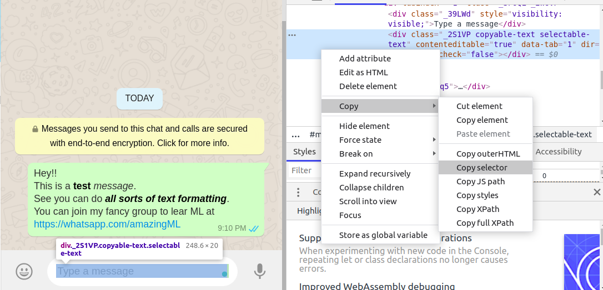

# WhatsApp Bulk Messenger :loudspeaker:

  
    

## What it does?
This tool makes adding multiple people to a WhatsApp group much easier. 

This tool allows you to directly send messages to people without saving their contact on your phone. We can do this with the help of selenium python and WhatsApp web.

Another approach and a more official way are using Twilio API of Whatsapp but the issue is that it uses sandbox(a dummy number within an environment) and new users have to connect to that sandbox by sending a message to a specific number and with the python script, it sends text message of your bulk people who already connected to a sandbox and then sandbox send it to those users. 
[script->sandbox->whatsapp]

## :rocket: Getting Started 

### :iphone: Adding Phone Numbers

You may use any or all of the following methods to enter the mobile numbers

1. When you execute `python run.py`, you can enter any number of comma-separated 10 digit phone numbers at the prompt, at once.
2. In the file `numbers.txt` which will store all the 10 digit numbers, each on a line; Add all 10 digit phone numbers you will like to send text. 

For experimental Twilio Script execute`python wpautomate.py`, make sure you fill your own Twilio API keys and setup sandbox from [Twilio website](https://www.twilio.com/) ->whatsapp beta

### :running: Running

1. Open the file `run.py` and update the variable `msg` with the message you want to send to all the numbers.
2. Make sure you've added the numbers properly. Make sure there are no duplicates.
3. When the automated Chrome browser window opens up, be ready to scan the QR code with your phone to sign in to WhatsApp Web, more info on how to do this can be found in the [WhatsApp Web faq](https://faq.whatsapp.com/en/web/28080003/).

## :stars: Advanced Tips and Tricks

1. For using country codes other than India but only one country, please change it in the `url` string in `run.py`.
2. For multiple countries, please remove the _91_ from `url` string, and prepend each number directly with the country code, without plus symbol, for example, 09940694571 for the US.

## :dragon: Debugging
This program uses a CSS Selector to find out where exactly to write the message, just like a human would. And that keeps changing over time based on how [WhatsApp Web](https://web.whatsapp.com) is designed. So all we have to do is update the CSS Selector in the code, by doing the following:

1. Right-click on the white space in [WhatsApp Web](https://web.whatsapp.com) where you type the message, 
2. Press Inspect element
3. From the inspector in chrome or any browser you're using, copy the CSS selector
4. Update the `css_selector` variable in the code.

That's it. :smiley:

### :heart: Found this project useful?

If you found this project useful, then please consider giving it a :star: on Github and sharing it with your friends via social media.

## Project Created & Maintained By

### Sagnik Chattopadhyaya

Microsoft Student Partner, Student, Working for betterment of all, Competitive Coder, YouTuber

# Donate

> If you found this project helpful or you learned something from the source code and want to thank me, consider buying me a cup of :coffee:
>

  
  
